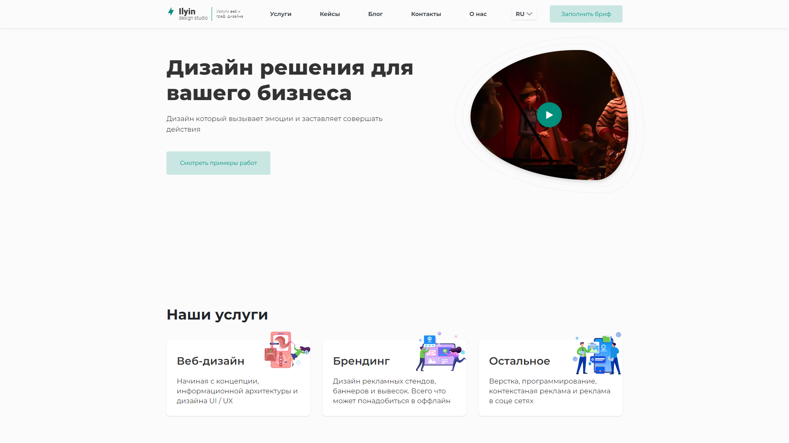

# Design studio concept site

**📝 Task**
1. Convert Figma design to static multipages site
2. Add custom checkbox and radio buttons
3. Add modal window for video player
4. Add Slider for work section
5. Add stepbox section
6. Add article filter for blog page
7. Full responsive view

**⚙ Technologies & Tools**
1. JavaScript
2. HTML5
3. SCSS/CSS3
4. Swiper Slider
5. BEM naming
6. Gulp JS

**💻 Live preview**

[github pages link](https://valerii-frontend.github.io/Corporate_website--ilyin_studio/)

**👤 Author**

[V.Lozghachov - linkedIn profile](https://www.linkedin.com/in/valerii-lozghachov/)
